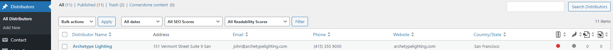
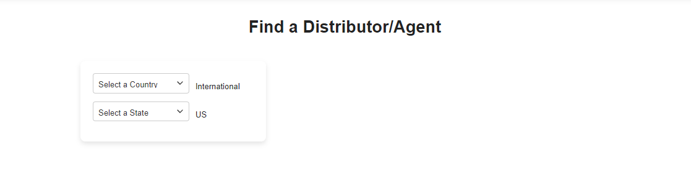
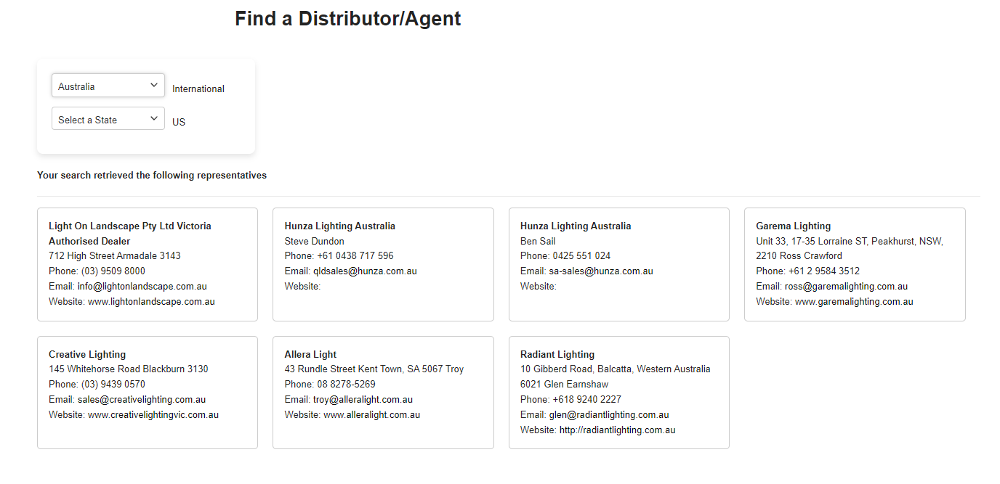

# Distributor Locator Plugin

**Description**: A plugin to add distributors and allow users to search by country or state.

## Features

- Add and manage distributor details from the WordPress dashboard.
- Allow users to search distributors by country or state.
- Simple and intuitive interface for managing distributor listings.
- Search results displayed on a customizable frontend page.

## Installation

1. Download the plugin and upload it to your WordPress site.
2. Navigate to **Plugins > Add New**.
3. Click on **Upload Plugin** and select the `.zip` file you just downloaded.
4. Click **Install Now**, then **Activate** the plugin.

## Usage

1. After activation, go to the **Distributor** section in your WordPress admin dashboard.
2. Add your distributors with relevant details like name, address, country, and state.
3. To allow users to search distributors by country or state, use the shortcode below on any page or post:
4. Customize the search form and results in the plugin settings.

## Shortcode

- `[distributor_map]`: Displays a search form allowing users to search distributors by country or state.

## Customization

You can extend the plugin’s functionality by adding custom CSS or JavaScript. For example, to customize the search form, you can enqueue your own styles and scripts through your theme or plugin.

## Support

For any issues, feel free to open an issue on the [GitHub repository](https://github.com/amosngisa/Distributor-Locator) or contact the author.

## License

This plugin is licensed under the [GPLv2 or later](https://www.gnu.org/licenses/gpl-2.0.html).

---

### Screenshots

1. **Admin Panel** - Add and manage distributors.
 

2. **Search Form** - Users can search distributors by country or state.
 
 
3. **Search Results** - Display matching distributors based on user input.
 
